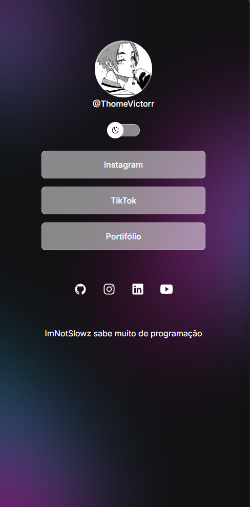

# 🌐 ThoméLinks

<div align="center">
  
</div>

<p align="center">
  <strong>Um agregador de links simples e moderno, feito para reunir todos os meus contatos em um só lugar.</strong>
</p>

---

## 📖 Sobre o Projeto

O **ThoméLinks** é um projeto inspirado no Linktree.  
Ele permite centralizar seus principais links (redes sociais, portfólio, contatos) em uma única página estilosa e responsiva.

---

## 🚀 Tecnologias

- **HTML5**
- **CSS3**
- **JavaScript (modo dark/light)**
- **Google Fonts (Inter)**

---

## 🎨 Layout

✨ Design minimalista com foco em acessibilidade e experiência do usuário.  
Adapta-se tanto para **dark mode** quanto **light mode**.

📸 Exemplo de tela:

<div align="center">
  <!-- substitua pelo print real -->
  
</div>

---

## 🛠️ Como usar

1. Clone este repositório:
   ```bash
   git clone https://github.com/SeuUsuario/ThomeLinks.git
   ```
